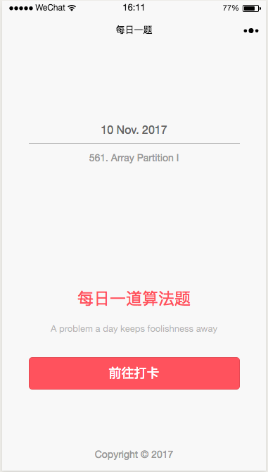
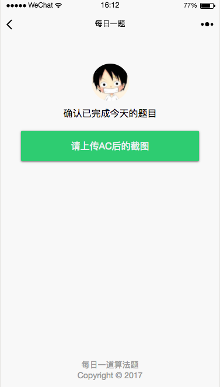
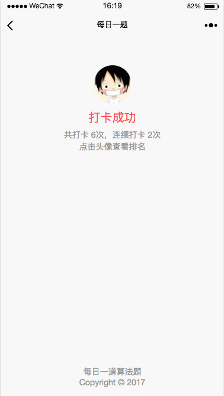
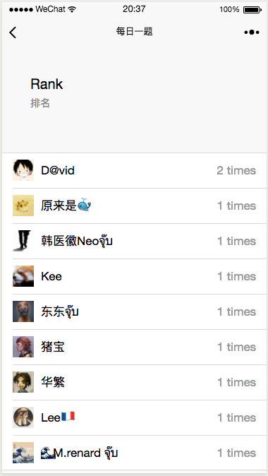

# 每日一道算法题 - 

## 微信打卡小程序

前端直接用微信提供的开发者工具写的，后端采用的是 leancloud。

leancloud sdk 需要依赖一个在名为 leancloud.config.js 的文件，它被放在 utils 文件夹里，我push代码时没有包括 leancloud.config.js 。

leancloud.config.js 包含了 leancloud 应用的 AppID 和 AppKey 信息：

```
module.exports = {
  appId: '你的AppID',
  appKey: '你的AppKey'
}
```

###  Database design

数据库的设计采用了一个中间表 `Check` 来确定打卡的动作。

由于 leancloud 提供的数据库的性能有限，对子查询的支持也不太好。

所以设计数据库的时候冗余设计了 `rank` 表。


```
User:
  nickname: (string)
  gender: (number)
  avatarUrl: (string)
  location: { "country" : (string) , "province": (string) , "city": (string) }
  language: (string)
  belongsTo: (group)
  checktime: (number)
  lastcheckDate: (date)
  longestAttendence: (number)

Check:
  checkedAt (datatime)
  question (Question)
  user (User)
  image (file)

Group:
  hasMany: User

Question:
  date: (date)
  title: (string)
  content: (string)
  url: (string)

Rank:
  user: (string)
  avatarUrl: (string)
  checktime: (number)

```

程序还很新，而且我第一次开发小程序，难免会有不完善的地方。

###  程序截图

主页



---

打卡页



---

打卡成功



---

查看排名 



(Also Thanks for the Contributors in the image)

